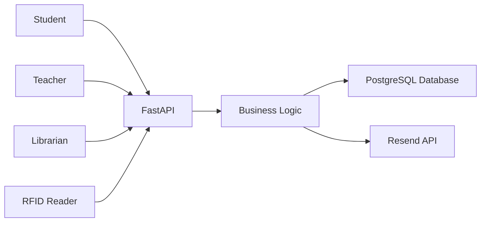

# 📚 SmartLib Ecosystem

> A smart RFID-powered library management system for universities and colleges.


---

## 🚀 Overview

SmartLib Ecosystem is a modern library management platform that combines a FastAPI web application with RFID hardware to automate attendance tracking, book borrowing, fine calculation, and library analytics.

The system supports three user roles:

- 🎓 Student
- 👨‍🏫 Teacher
- 📚 Librarian

Users can tap RFID cards to enter or leave the library, borrow books, track due dates, request renewals, and monitor fines through dedicated dashboards.

---

## ✨ Features

### 📖 Book Management
- Add and manage books
- Upload book covers
- Organize books by shelf
- Search books instantly

### 🪪 RFID Attendance
- RFID card linking
- Automatic entry/exit tracking
- Stay duration calculation
- Real-time occupancy monitoring

### 🔄 Borrow & Return System
- Issue books
- Return books
- Automatic due date assignment
- Email borrowing receipts

### 💰 Fine Management
- Automatic overdue detection
- Daily fine calculation
- Fine history tracking

### 🔁 Renewal Requests
- Students request extensions
- Librarians approve/reject requests
- Renewal status tracking

### 📊 Analytics Dashboard
- Total users
- Total books
- Active loans
- Overdue books
- Library footfall statistics
- Current occupancy

### 🔒 Security & Auditing
- Password hashing
- Session authentication
- RFID device verification
- Full audit logging

---

## 🏗️ System Architecture



---

## ⚙️ Tech Stack

| Layer | Technology |
|---------|------------|
| Backend | FastAPI |
| Database | PostgreSQL (Supabase) |
| ORM | SQLAlchemy |
| Validation | Pydantic |
| Authentication | SessionMiddleware + Passlib |
| Frontend | Jinja2 + HTML/CSS/JavaScript |
| Email | Resend API |
| Hardware | RFID Reader + Keypad |
| Containerization | Docker |

---

## 📂 Project Structure

```text
smartlib/
│
├── app/
│   ├── api/
│   ├── routes/
│   ├── services/
│   ├── models/
│   ├── templates/
│   └── static/
│
├── create_tables.py
├── requirements.txt
├── Dockerfile
└── .env
```

---

## 🚀 Installation

### Clone Repository

```bash
git clone https://github.com/ninad-devx/smartlib.git
cd smartlib
```

### Create Virtual Environment

```bash
python -m venv venv
```

Windows:

```bash
venv\Scripts\activate
```

Linux/macOS:

```bash
source venv/bin/activate
```

### Install Dependencies

```bash
pip install -r requirements.txt
```

---

## 🔧 Environment Variables

Create a `.env` file:

```env
DB_USER=your_database_user
DB_PASSWORD=your_database_password
DB_HOST=your_database_host
DB_PORT=5432
DB_DATABASE=your_database_name

SECRET_KEY=your_secret_key
SESSION_SECRET=your_session_secret
DEVICE_SECRET=your_device_secret

MAIL_EMAIL=your_email
MAIL_PASSWORD=your_password

RESEND_API_KEY=your_resend_api_key
```

---

## 🗄️ Create Database Tables

```bash
python create_tables.py
```

---

## ▶️ Run Application

```bash
uvicorn app.main:app --reload
```

Open:

```text
http://127.0.0.1:8000
```

---

## 🐳 Docker Deployment

Build image:

```bash
docker build -t smartlib .
```

Run container:

```bash
docker run -p 8000:8000 --env-file .env smartlib
```

---

## 🪪 RFID Hardware Integration

### Endpoint

```http
POST /api/v1/hardware/gateway
```

### Headers

```http
x-device-secret: YOUR_DEVICE_SECRET
```

### Request Body

```json
{
  "device_id": "LIBRARY_GATE_01",
  "rfid_uid": "123456789"
}
```

---

## 👥 User Roles

<details>
<summary>🎓 Student</summary>

- View borrowed books
- View due dates
- Track fines
- Request renewals
- Attendance history

</details>

<details>
<summary>👨‍🏫 Teacher</summary>

- Extended borrowing periods
- Fine tracking
- Renewal requests
- Attendance history

</details>

<details>
<summary>📚 Librarian</summary>

- Manage books
- Manage shelves
- Issue/return books
- Approve renewals
- View attendance logs
- View audit logs
- Dashboard analytics

</details>

---

## 📈 Future Enhancements

- Mobile application
- QR-code check-in
- Smart book recommendations
- RFID self-checkout kiosks
- Analytics dashboard improvements
- Multi-library support

---

## 🤝 Contributing

Contributions are welcome.

1. Fork the repository
2. Create a feature branch
3. Commit your changes
4. Push to your branch
5. Open a Pull Request

---

## 📜 License

This project is licensed under the MIT License.

---

## ⭐ Support

If you found this project useful, consider giving it a star ⭐ on GitHub.